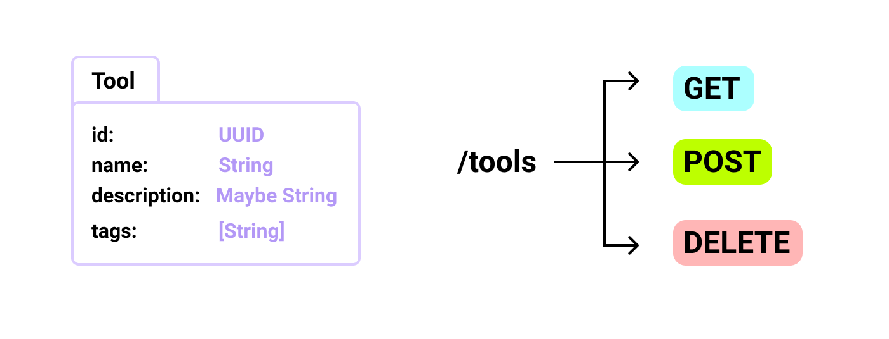

<div align="center">
  

  A project to explore **haskell** and **nix**

  A small tools API with database access
</div>



The development stack so far:

- Haskell
- Nix
- Arion (docker-compose)
- postgres-typed
- warp
- wai
- sqitch (migrations management)

Todo:
- [ ] tests (hspec perhaps)
- [ ] implement the PUT method
- [x] implement the GET method for a single tool
- [x] build docker image (with nix)

### Running

```sh
$ nix-shell
$ make db-start
$ make build
$ ./result/bin/hello
```

> The database is required for the build

I'm still learning and searching some architectures and best
practices to follow and apply in this project.
